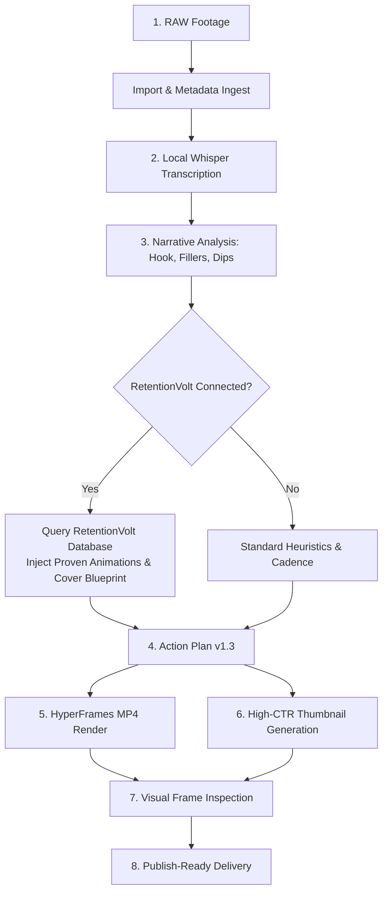

<p align="center">
  <br>
  <h1 align="center">⚡ RETENTION</h1>
  <p align="center">
    <strong>🎥 Edit videos like a pro — powered by retention engineering & RetentionVolt</strong>
  </p>
  <p align="center">
    <a href="https://retentionvolt.com"><strong>RetentionVolt.com</strong></a> ·
    <a href="#-video-editing-for-the-agent-era"><strong>Features</strong></a> ·
    <a href="#-supercharged-by-retentionvolt"><strong>Retention Intelligence</strong></a> ·
    <a href="#-quickstart"><strong>Quickstart</strong></a> ·
    <a href="#%EF%B8%8F-mcp-tools"><strong>MCP Tools</strong></a>
  </p>
  <p align="center">
    <a href="https://retentionvolt.com"></a>
    <a href="https://modelcontextprotocol.io"></a>
    <a href="https://www.npmjs.com/package/hyperframes"></a>
    <a href="https://github.com/SYSTRAN/faster-whisper"></a>
    <a href="LICENSE.md"></a>
  </p>
  <br>
</p>

---

## 🎥 Video Editing for the Agent Era

Inspired by the programmatic, code-first vision of [Remotion](https://github.com/remotion-dev/remotion), **Retention** brings video creation and retention engineering directly into the AI agent age.

Turn raw, unedited creator recordings into a publish-ready video with millisecond-accurate cuts, dynamic motion graphics, karaoke captions, and high-CTR thumbnail covers — completely agentically:

- **Edit agentically**: Hand your RAW footage over to your AI coding agent (Claude Code, Antigravity, Codex, Cursor) and let it cut, caption, and render automatically.
- **Edit scientifically**: Connect to **[RetentionVolt](https://retentionvolt.com)** to inject proven pacing curves, motion graphics, and high-CTR thumbnail recipes reverse-engineered from world-class creators.
- **Edit deterministically**: Whisper speech analysis and HyperFrames headless browser composition guarantee millisecond-accurate sync. No timeline dragging, no Premiere, no DaVinci.

> **JSON timestamps and EditPlans are the source of truth.** Switch seamlessly between 100% free local editing and RetentionVolt Pro cloud blueprints without changing your workflow.

---

## ⚡ Supercharged by RetentionVolt (`retentionvolt.com`)

**[RetentionVolt](https://retentionvolt.com) is Mobbin for video retention engineering.**

It maintains a curated, agent-readable database of hundreds of viral, top-performing videos from elite creators (MrBeast, Ali Abdaal, Alex Hormozi) analyzed second by second:

- **Retention Curves & Pacing Cadence**: Millisecond-accurate cuts designed to prevent audience drop-off and maximize watch time.
- **Pattern Interrupts & Framing Shifts**: Strategic camera punches and visual resets proven to keep viewers hooked.
- **Production-Grade Motion Graphics**: Dynamic, content-aware banners and lower-thirds that significantly elevate perceived quality.
- **High-CTR Thumbnail Generation**: Data-driven cover concepts, high-contrast typography, and badge layouts engineered to boost click-through rates.

### Two Complementary Modes of Operation:
1. **RetentionVolt Enhanced (Recommended)**: Connect to the `retentionvolt` MCP server. The agent bypasses heuristic guesswork for animations and graphics; it queries the RetentionVolt database to inject tested, high-performing retention patterns directly.
2. **Standalone Local Mode**: 100% free, private, and offline. Operates using local Whisper transcription and deterministic heuristic cadence. No artificial limits, no paywalls.

---

## 🆚 Traditional Editing vs. Retention

| Without Retention | With Retention (+ RetentionVolt) |
|---|---|
| Scrub 40 min of footage by hand | Local Whisper transcribes every word with timestamps (~100 languages) |
| Guess where viewers will drop off | Deterministic narrative analysis + RetentionVolt proven retention curves |
| Manual cuts drift and miss the beat | Every cut references transcript timecodes with the strict **Cuts-First** rule |
| Static talking-head causes viewer churn | Pattern interrupts & motion graphics mapped from viral video blueprints |
| Captions manually typed and synced | Dynamic karaoke captions with keyword emphasis placed automatically |
| Thumbnails designed from scratch | High-CTR cover / thumbnail generated automatically from the hook moment |
| Render, review, and fix alone | Autonomous agent loop: plan → draft render → visual frame review → final |

---

## 🧠 Architecture & Pipeline



### ✂️ The "Cuts-First" Guarantee
1. **Raw to Clean (Local Engine)**: Whisper and local speech heuristics detect dead air (>0.8s), filler words (*"ehm"*, *"uhm"*), stutters, and false starts. These are cleanly spliced into `KEEP` ranges.
2. **Clean to High-Retention (RetentionVolt)**: RetentionVolt operates strictly on the saved content, placing animations and interrupts where they maximize engagement without ever colliding with cleanup splices.

---

## 🚀 Quickstart

### Prerequisites
- **Node.js**: ≥ 20 (Node 22 recommended)
- **FFmpeg**: Available in system `PATH`
- **Python**: 3.9+ (for `faster-whisper`)

### Installation
```bash
# Clone the repository
git clone https://github.com/Andrea13235/Retention.git
cd Retention

# Install dependencies
npm install

# Run one-time Whisper automated setup
node scripts/setup-whisper.js

# Verify environment readiness
npm run setup-check

# Compile TypeScript
npm run build

# Run comprehensive test suite (36/36 tests passing)
npm test
```

### Configure with your AI Agent (MCP Configuration)
Add to your client configuration (`claude_desktop_config.json`, Cursor MCP, Codex, or Antigravity):

```json
{
  "mcpServers": {
    "retention": {
      "command": "node",
      "args": ["/absolute/path/to/retention/dist/server.js"]
    }
  }
}
```

---

## 🛠️ MCP Tools

| Tool | Phase | Purpose |
|---|---|---|
| `connect_retentionvolt` | Step 0 | Check connection status or authenticate with RetentionVolt CyberMCP (`retentionvolt.com`) |
| `fetch_retentionvolt_blueprint` | Step 0 | Query viral retention curves, motion graphics, and thumbnail formulas |
| `import_raw_media` | Step 1 | Register RAW footage and extract resolution, duration, fps, and audio streams |
| `transcribe_media` | Step 2 | Local Whisper transcription with millisecond word timecodes (~100 languages) |
| `analyze_transcript` | Step 3 | Narrative analysis: hook, sections, filler words, attention dips, and cut candidates |
| `generate_edit_plan` | Step 4 | Generate Action Plan v1.3 with confidence-gated cuts, karaoke captions, and motion graphics |
| `generate_thumbnail` | Step 4b | Extract hook base frame and export high-CTR companion metadata (title, badge, style) |
| `render_video` | Step 5+6 | Build HyperFrames composition and render final MP4 (draft/standard/high presets) |

---

## 💡 Style Cadence Registers

| Style | Cadence | Best For |
|---|---|---|
| `educational` *(default)* | ~5s | Explainers, talking-head YouTube, product tutorials |
| `show` | ~2s | MrBeast-grade energy (requires `takesCount ≥ 2` for real multi-cam) |
| `tutorial` | ~20s | Code & screen recordings (screen changes, face holds) |
| `podcast` | ~60s | Conversations and interviews with room to breathe |
| `short_form` | ~4s | 9:16 vertical TikToks, Reels, and YouTube Shorts |

---

## 📦 Repository Layout

```
Retention/
├── SKILL.md                    # Agent workflow: 8-stage pipeline, onboarding, rules
├── docs/
│   └── analysis-guide.md       # Editor craft: cut rules, attention curve, EditPlan reference
├── src/
│   ├── server.ts               # MCP server (stdio transport, 8 tools)
│   ├── retentionvolt_client.ts # RetentionVolt CyberMCP cloud client & local fallback
│   ├── tools_ingest.ts         # Step 1: RAW import + ffprobe metadata
│   ├── tools_transcribe.ts     # Step 2: local Whisper, word timecodes, language detect
│   ├── tools_analyze.ts        # Step 3: hook, sections, fillers, dips, highlights
│   ├── tools_plan.ts           # Step 4: Action Plan v1.3 + RetentionVolt blueprint
│   ├── tools_render.ts         # Step 5: HyperFrames render + thumbnail generator
│   └── types.ts                # TypeScript contracts & RetentionVolt schemas
├── scripts/
│   ├── setup-whisper.js        # Dedicated venv + faster-whisper setup
│   └── setup-check.js          # Verify environment
└── tests/                      # 36/36 passing tests (unit, pipeline, e2e)
```

---

## 📄 License

Free for individuals and small teams up to 3 people (including commercial use). See [LICENSE.md](LICENSE.md). Third-party credits in [CREDITS.md](CREDITS.md).

---

<p align="center">
  Crafted by <a href="https://github.com/Andrea13235"><strong>Andrea Barretta</strong></a> · Supercharged by <a href="https://retentionvolt.com"><strong>RetentionVolt.com</strong></a>
</p>
